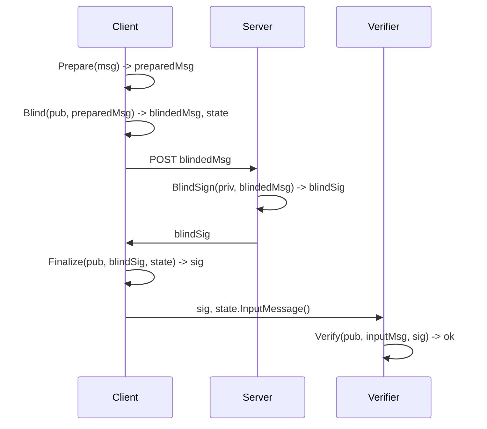

# blindrsa

RSA Blind Signatures (RFC 9474 / RSABSSA) for Go.

RSA Blind Signatures allow a client to obtain an RSA signature from a server
without the server learning what message was signed. This is used for
privacy-preserving tokens (e.g., Privacy Pass).

## Variants

All four RFC 9474 variants are supported, using SHA-384 and RSA-PSS:

| Constant | Variant | Salt Length | Randomized |
|----------|---------|-------------|------------|
| `VariantSHA384PSSRandomized` | RSABSSA-SHA384-PSS-Randomized | 48 (hash len) | Yes |
| `VariantSHA384PSSZERORandomized` | RSABSSA-SHA384-PSSZERO-Randomized | 0 | Yes |
| `VariantSHA384PSSDeterministic` | RSABSSA-SHA384-PSS-Deterministic | 48 (hash len) | No |
| `VariantSHA384PSSZERODeterministic` | RSABSSA-SHA384-PSSZERO-Deterministic | 0 | No |

Randomized variants prepend a random prefix to the message before blinding,
providing stronger unlinkability guarantees. RSA keys must be at least 2048
bits.

## Protocol Flow



## Core API

### Blind (Client)

### Prepare (Client)

```go
priv, _ := rsa.GenerateKey(rand.Reader, 2048)
pub := &priv.PublicKey
msg := []byte("message to sign")

// Prepare adds a 32-byte random prefix for randomized variants.
// For deterministic variants, it returns a copy of the message.
preparedMsg, err := blindrsa.Prepare(blindrsa.VariantSHA384PSSDeterministic, rand.Reader, msg)
if err != nil {
    log.Fatal(err)
}
```

### Blind (Client)

```go
blindedMsg, state, err := blindrsa.Blind(blindrsa.VariantSHA384PSSDeterministic, pub, rand.Reader, preparedMsg)
if err != nil {
    log.Fatal(err)
}
// Send blindedMsg to the server.
```

### BlindSign (Server)

```go
blindSig, err := blindrsa.BlindSign(blindrsa.VariantSHA384PSSDeterministic, priv, blindedMsg)
if err != nil {
    log.Fatal(err)
}
// Return blindSig to the client.
```

### Finalize (Client)

```go
sig, err := blindrsa.Finalize(blindrsa.VariantSHA384PSSDeterministic, pub, blindSig, state)
if err != nil {
    log.Fatal(err)
}
// sig is a standard RSA-PSS signature.
```

### Verify (Anyone)

```go
// For randomized variants, use state.InputMessage() instead of the original msg.
err := blindrsa.Verify(blindrsa.VariantSHA384PSSDeterministic, pub, state.InputMessage(), sig)
if err != nil {
    log.Fatal("verification failed:", err)
}
```

For randomized variants the prepared message (including the 32-byte random
prefix) is available via `state.InputMessage()`. This value must be used for
verification instead of the original message.

## HTTP Integration

### Issuer Handler (Server)

`IssueHandler` returns an `http.Handler` that accepts a blinded message as
the request body and responds with the blind signature.

```go
handler, err := blindrsa.IssueHandler(blindrsa.IssuerConfig{
    Key:     priv,
    Variant: blindrsa.VariantSHA384PSSDeterministic,

    // Optional: custom error handler. Default: 400 Bad Request.
    OnError: func(w http.ResponseWriter, r *http.Request, err error) {
        http.Error(w, "issuance failed", http.StatusBadRequest)
    },

    // Optional: max request body size in bytes. Default: 4096.
    MaxBodySize: 1024,
})
if err != nil {
    log.Fatal(err)
}

router := mux.NewRouter()
router.Handle("/api/v1/issue", handler).Methods(http.MethodPost)
```

### Client

`NewClient` creates a client that executes the full blind signature protocol
over HTTP: blind, send to issuer, finalize.

```go
client, err := blindrsa.NewClient(blindrsa.ClientConfig{
    Key:           pub,
    Variant:       blindrsa.VariantSHA384PSSDeterministic,
    TokenEndpoint: "https://issuer.example.com/api/v1/issue",
})
if err != nil {
    log.Fatal(err)
}

sig, state, err := client.ObtainSignature(context.Background(), []byte("message to sign"))
if err != nil {
    log.Fatal(err)
}
// sig is the final RSA-PSS signature.
// state.InputMessage() is the prepared message for verification.
```

Pass an `*http.Transport` for custom proxy, TLS, and timeout settings:

```go
client, err := blindrsa.NewClient(blindrsa.ClientConfig{
    Key:           pub,
    Variant:       blindrsa.VariantSHA384PSSDeterministic,
    TokenEndpoint: "https://issuer.example.com/api/v1/issue",
    Transport: &http.Transport{
        Proxy:           http.ProxyFromEnvironment,
        TLSClientConfig: &tls.Config{MinVersion: tls.VersionTLS13},
        IdleConnTimeout: 90 * time.Second,
    },
})
```

### Verification Middleware (Server)

`VerifyMiddleware` returns a `mux.MiddlewareFunc` that verifies blind
signatures on incoming requests using a base64-encoded signature header.

```go
mw, err := blindrsa.VerifyMiddleware(blindrsa.MiddlewareConfig{
    Key:     pub,
    Variant: blindrsa.VariantSHA384PSSDeterministic,

    // Extract the prepared message from the request.
    MessageFunc: func(r *http.Request) ([]byte, error) {
        return []byte(r.Header.Get("X-Token-Message")), nil
    },

    // Optional: header name for the signature. Default: "Blind-Signature".
    HeaderName: "Blind-Signature",

    // Optional: custom error handler. Default: 401 Unauthorized.
    OnError: func(w http.ResponseWriter, r *http.Request, err error) {
        http.Error(w, "invalid token", http.StatusUnauthorized)
    },
})
if err != nil {
    log.Fatal(err)
}

router := mux.NewRouter()
router.Use(mw)
router.HandleFunc("/api/v1/resource", handleResource).Methods(http.MethodGet)
```

## End-to-End Example

A complete example: client obtains a token from an issuer, then presents it
to a protected resource.

```go
package main

import (
    "context"
    "crypto/rand"
    "crypto/rsa"
    "encoding/base64"
    "fmt"
    "log"
    "net/http"

    "github.com/vitalvas/kasper/blindrsa"
    "github.com/vitalvas/kasper/mux"
)

func main() {
    priv, err := rsa.GenerateKey(rand.Reader, 2048)
    if err != nil {
        log.Fatal(err)
    }
    pub := &priv.PublicKey
    variant := blindrsa.VariantSHA384PSSDeterministic

    // Issuer: signs blinded messages.
    issueHandler, err := blindrsa.IssueHandler(blindrsa.IssuerConfig{
        Key:     priv,
        Variant: variant,
    })
    if err != nil {
        log.Fatal(err)
    }

    issuerRouter := mux.NewRouter()
    issuerRouter.Handle("/api/v1/issue", issueHandler).Methods(http.MethodPost)

    issuerServer := &http.Server{Addr: ":8081", Handler: issuerRouter}
    go issuerServer.ListenAndServe()

    // Client: obtains a blind signature.
    client, err := blindrsa.NewClient(blindrsa.ClientConfig{
        Key:           pub,
        Variant:       variant,
        TokenEndpoint: "http://localhost:8081/api/v1/issue",
    })
    if err != nil {
        log.Fatal(err)
    }

    msg := []byte("access-token-payload")
    sig, state, err := client.ObtainSignature(context.Background(), msg)
    if err != nil {
        log.Fatal(err)
    }

    inputMsg := state.InputMessage()

    // Resource server: verifies the token.
    mw, err := blindrsa.VerifyMiddleware(blindrsa.MiddlewareConfig{
        Key:     pub,
        Variant: variant,
        MessageFunc: func(r *http.Request) ([]byte, error) {
            return base64.StdEncoding.DecodeString(r.Header.Get("X-Token-Message"))
        },
    })
    if err != nil {
        log.Fatal(err)
    }

    resourceRouter := mux.NewRouter()
    resourceRouter.Use(mw)
    resourceRouter.HandleFunc("/api/v1/data", func(w http.ResponseWriter, r *http.Request) {
        w.Write([]byte(`{"data":"secret"}`))
    }).Methods(http.MethodGet)

    resourceServer := &http.Server{Addr: ":8082", Handler: resourceRouter}
    go resourceServer.ListenAndServe()

    // Client: accesses the protected resource with the token.
    req, _ := http.NewRequest(http.MethodGet, "http://localhost:8082/api/v1/data", nil)
    req.Header.Set("Blind-Signature", base64.StdEncoding.EncodeToString(sig))
    req.Header.Set("X-Token-Message", base64.StdEncoding.EncodeToString(inputMsg))

    resp, err := http.DefaultClient.Do(req)
    if err != nil {
        log.Fatal(err)
    }
    defer resp.Body.Close()

    fmt.Println("Status:", resp.StatusCode) // Status: 200
}
```

## Errors

| Error | Description |
|-------|-------------|
| `ErrInvalidKey` | Key is nil, wrong type, or less than 2048 bits |
| `ErrInvalidInput` | Input parameter is nil, empty, or wrong size |
| `ErrBlindingFailed` | Blinding operation failed |
| `ErrSignatureFailed` | Blind signing failed |
| `ErrFinalizeFailed` | Unblinding or finalization failed |
| `ErrVerifyFailed` | Signature verification failed |
| `ErrUnsupportedVariant` | Unknown RSABSSA variant |
| `ErrMessageTooLong` | Message too long for key size |
| `ErrNoSigner` | Handler config missing signing key |
| `ErrNoVerifier` | Config missing verification key |

## Standards

- [RFC 9474](https://www.rfc-editor.org/rfc/rfc9474) - RSA Blind Signatures
- [RFC 8017](https://www.rfc-editor.org/rfc/rfc8017) - PKCS #1: RSA Cryptography Specifications
