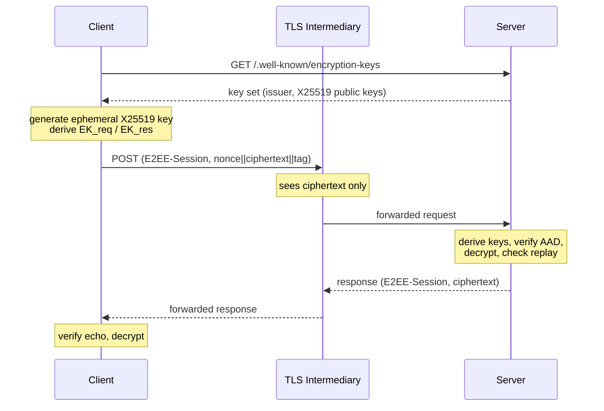

# e2ee

End-to-end encryption for HTTP API payloads, implementing
[draft-vasylenko-e2ee-http](https://datatracker.ietf.org/doc/draft-vasylenko-e2ee-http/).

This package protects HTTP request and response bodies independently of, and
in addition to, transport security such as TLS. It is designed for deployments
where intermediaries terminate TLS and observe plaintext: CDNs, reverse
proxies, and load balancers. Such intermediaries can route and observe metadata
but cannot read or tamper with protected payloads.

## Overview

The scheme combines three primitives from the Go standard library:

| Primitive | Algorithm | Reference |
| --- | --- | --- |
| Key agreement | X25519 | RFC 7748 |
| Key derivation | HKDF-SHA256 | RFC 5869 |
| Authenticated encryption | AES-128/192/256-GCM | NIST SP 800-38D |

Control metadata travels in the `E2EE-Session` HTTP field, an
[RFC 9651](https://www.rfc-editor.org/rfc/rfc9651) Structured Field Item. The
deterministically serialized field is bound into the AES-GCM additional
authenticated data (AAD), so any modification by an intermediary fails
decryption.



## Message Format

A protected body is the concatenation:

```
body = nonce (12 octets) || ciphertext || tag (16 octets)
```

The `E2EE-Session` field carries:

| Parameter | Type | Request | Response | Meaning |
| --- | --- | --- | --- | --- |
| _(item value)_ | String | required | required | key identifier (kid) |
| `aead` | String | required | required | AES-GCM suite |
| `epk` | Byte Sequence | required | prohibited | client ephemeral public key |
| `ts` | Integer | required | required | Unix timestamp |
| `nid` | String | required | required | per-message replay identifier |
| `cty` | String | optional | optional | inner plaintext media type |

## Key Discovery

A server publishes its public keys as a JSON key set at
`/.well-known/encryption-keys`.

```go
serverKey, err := e2ee.GenerateServerKey("2026-06", 24*time.Hour, e2ee.DefaultMaxSkew)
if err != nil {
    log.Fatal(err)
}

set, err := e2ee.NewServerKeySet("https://api.example.com", serverKey)
if err != nil {
    log.Fatal(err)
}

router.Handle(e2ee.WellKnownPath, set.Handler())
```

Keys can also be loaded from persisted material with `NewServerKey`, taking a
raw 32-byte X25519 private scalar. Publish overlapping keys and rotate
frequently with short `not_after` windows for seamless rotation.

A client retrieves and validates the key set with `FetchKeySet`:

```go
keys, err := e2ee.FetchKeySet(http.DefaultClient, "https://api.example.com")
if err != nil {
    log.Fatal(err)
}
```

## Client Transport

`NewTransport` returns an `http.RoundTripper` that encrypts each outgoing
request body, sets the `E2EE-Session` and `Content-Type` headers, and decrypts
the matching response in place.

```go
client := &http.Client{
    Transport: e2ee.NewTransport(nil, e2ee.ClientConfig{
        KeySet:      keys,
        ContentType: "application/json",
    }),
}

resp, err := client.Post(
    "https://api.example.com/api/v1/data",
    "application/json",
    strings.NewReader(`{"hello":"world"}`),
)
```

A fresh ephemeral key pair is generated per request by default. To reuse one
key pair across requests, configure a `Session`:

```go
session, err := e2ee.NewSession()
if err != nil {
    log.Fatal(err)
}

client := &http.Client{
    Transport: e2ee.NewTransport(nil, e2ee.ClientConfig{
        KeySet:  keys,
        Session: session,
    }),
}
```

Sessions must be scoped to a single logical client instance, never persisted,
and destroyed on process exit or user logout.

`RoundTrip` returns RFC 9457 Problem Details error responses
(`application/problem+json`) undecrypted so the caller can inspect the protocol
error.

## Server Middleware

`Middleware` returns a `mux.MiddlewareFunc` that decrypts incoming requests and
encrypts handler responses. Handlers read and write plaintext as usual.

```go
mw, err := e2ee.Middleware(e2ee.MiddlewareConfig{
    Server: e2ee.ServerConfig{KeySet: set},
})
if err != nil {
    log.Fatal(err)
}

api := router.PathPrefix("/api").Subrouter()
api.Use(mw)
api.HandleFunc("/v1/data", handleData)
```

The middleware performs the validation sequence from the draft in order:
parse the field, resolve the kid, validate the timestamp window and clock skew,
verify the AEAD is advertised, decode the ephemeral key, derive keys, decrypt
and verify the AAD, and finally insert the `nid` into the replay cache after
authentication succeeds.

### Replay Protection

A shared in-memory replay cache (`MemoryReplayCache`) is installed
automatically. To use a distributed cache (for example, backed by Redis),
implement the `ReplayCache` interface and supply it via `ServerConfig.Replay`:

```go
type ReplayCache interface {
    StoreUnique(kid string, epk []byte, nid string, ttl time.Duration) bool
}
```

`StoreUnique` must atomically record the `(kid, epk, nid)` tuple and return
`true` only if it was newly inserted.

## Errors

Protocol failures map to sentinel errors usable with `errors.Is`:

| Error | Code | HTTP Status |
| --- | --- | --- |
| `ErrKeyUnknown` | `key_unknown` | 400 |
| `ErrKeyExpired` | `key_expired` | 400 |
| `ErrAEADUnsupported` | `aead_unsupported` | 400 |
| `ErrDecryptFailed` | `decrypt_failed` | 400 |
| `ErrTimestampSkew` | `timestamp_skew` | 400 |
| `ErrReplayDetected` | `replay_detected` | 425 |
| `ErrMalformed` | `malformed` | 400 |

On the server they are rendered as RFC 9457 Problem Details with the URN type
`urn:ietf:params:e2ee:error:<code>`. Internal errors are never leaked: any
unrecognized error is reported as a generic `malformed` problem.

`Problem` is an alias for `muxhandlers.ProblemDetails`, reusing the shared
kasper implementation (including extension members), and `WriteProblem`
delegates to `muxhandlers.WriteProblemDetails`. The key-set `Handler` and
content types likewise reuse `mux.ResponseJSON` and the `mux.ContentType*`
constants.

## Threat Model

What this package protects:

- Confidentiality and integrity of request and response bodies against
  TLS-terminating intermediaries.
- Passive observers on plaintext channels behind a TLS terminator.

What it does **not** protect:

- HTTP metadata (method, path, status, non-body headers).
- Traffic analysis (timing, size, frequency).
- Client authentication, which is a separate concern.

HTTP request and response semantics are intentionally not bound into the AEAD,
to avoid conflicts with legitimate intermediary behavior such as path
normalization and header rewriting. Deployments that require end-to-end binding
of method, target URI, or status should layer
[HTTP Message Signatures](../httpsig) (RFC 9421) over the `E2EE-Session` field
and a `Content-Digest` (RFC 9530) of the exact ciphertext body.

Forward secrecy applies to client-side compromise only. Compromise of a server
private key decrypts all past sessions that used it; rotate keys frequently
with short validity windows.

## Dependencies

Cryptography uses only the Go standard library
(`crypto/ecdh`, `crypto/hkdf`, `crypto/aes`, `crypto/cipher`, `crypto/sha256`);
no third-party cryptographic dependencies are introduced. The package uses
`github.com/google/uuid` for replay-identifier generation and reuses the
sibling kasper packages `mux` (router middleware, JSON responses, content-type
constants) and `muxhandlers` (RFC 9457 Problem Details) rather than
reimplementing them.
